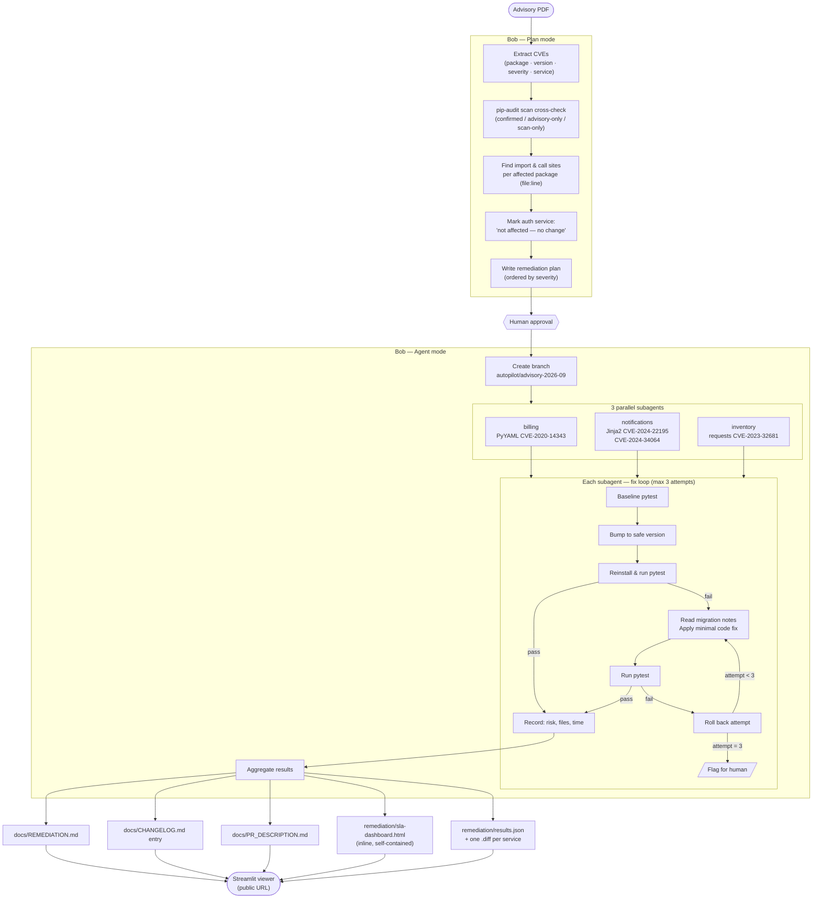

# CVE Autopilot — Architecture

## Notes

- **Plan mode** covers playbook steps 1–3 (read advisory, scan, find usages, write plan).  
  No files are changed until the human approves.
- **Agent mode** covers steps 4–9: branch, parallel subagents, aggregate, commit.
- **auth** is scanned but never modified; it appears in step 2 as "not affected — no change".
- The fix loop hard rules: no test deleted, skipped, or weakened; no public API changed without asking; `.venv/` never committed.
- Outputs feed the Streamlit app directly from committed files; the app makes no Bob or network calls.
